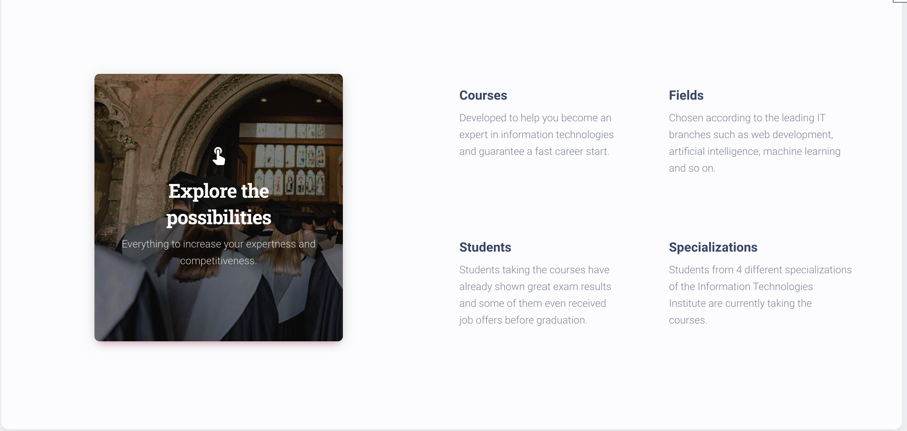
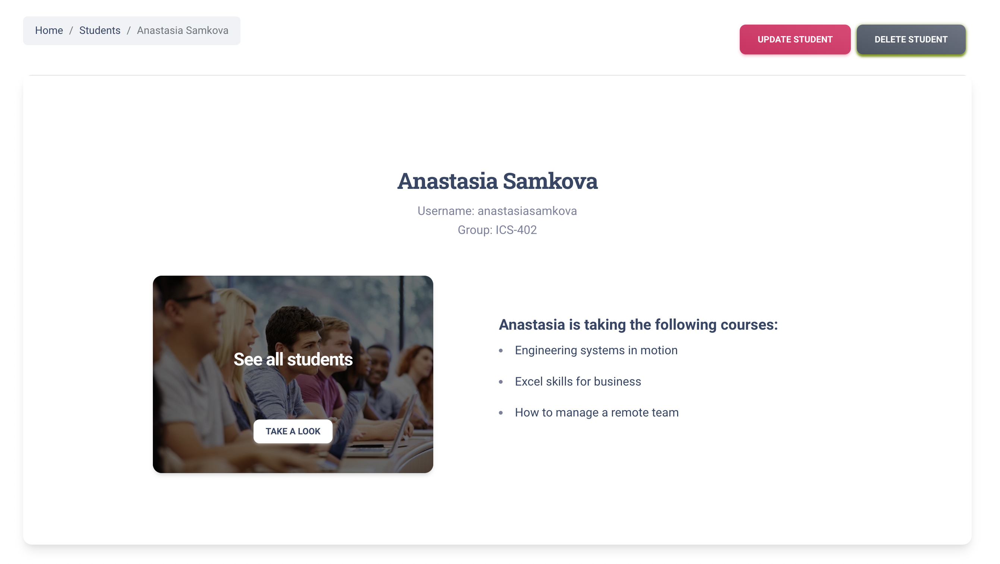

# University

Django project for managing students' assignments to optional courses.

## Check it out!

[University project deployed on Render](https://university-4i2r.onrender.com/)


## Installation

A quick introduction of the minimal setup:

Python3 must be already installed.

```shell
git clone https://github.com/KatyaVasylieva/university
cd university
python -m venv venv
source venv/bin/activate
pip install -r requirements.txt
python manage.py migrate
```

Set environment variables:

```shell
export DJANGO_DEBUG=<False to run in DEBUG=False or True for DEBUG=True>
export SECRET_KEY=<your SECRET_KEY>
export DATABASE_URL=<your DATABASE_URL>
```

Run Django server:
```shell
python manage.py runserver
```

You can use the following user to login:
  - Login: `user`
  - Password: `qazcdetgb`

## Features

* Authentication functionality for Student(User)
* Create/update/delete functionality for courses and students directly from website interface
* Possibility to assign or remove User from the particular course

## Demo





