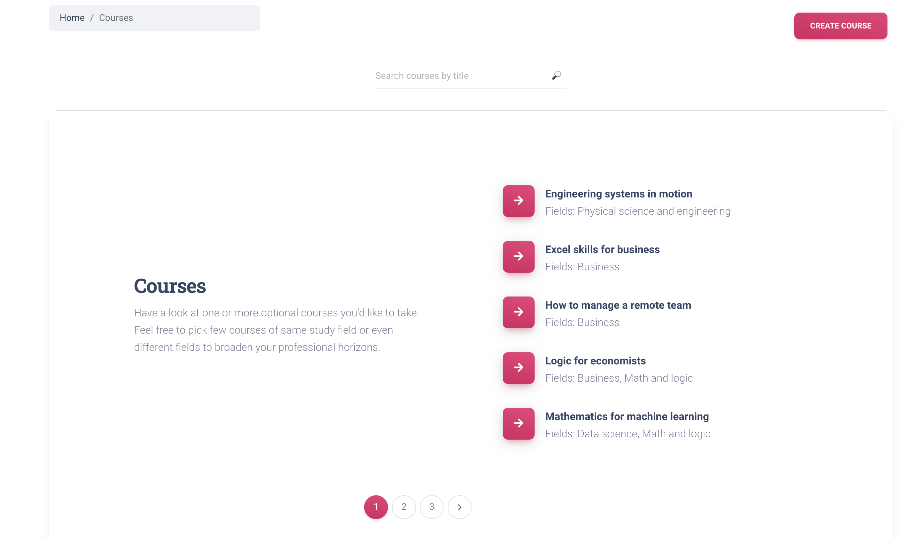

# University

Django project for managing students' assignments to optional courses.

## Check it out!

[University project deployed on Heroku](LINK)


## Installation

A quick introduction of the minimal setup:

Python3 must be already installed.

```shell
git clone https://github.com/KatyaVasylieva/university
cd university
python -m venv venv
source venv/bin/activate
pip install -r requirements.txt
python manage.py runserver # starts Django server
```

## Features

* Authentication functionality for Student(User)
* Create/update/delete functionality for courses and students directly from website interface
* Possibility to assign or remove User form particular course

## Demo




